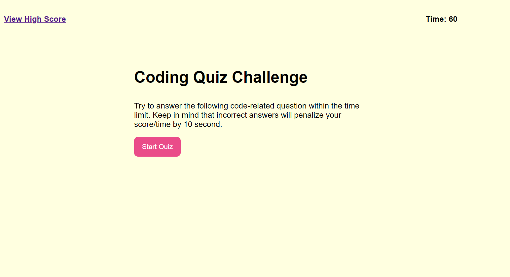
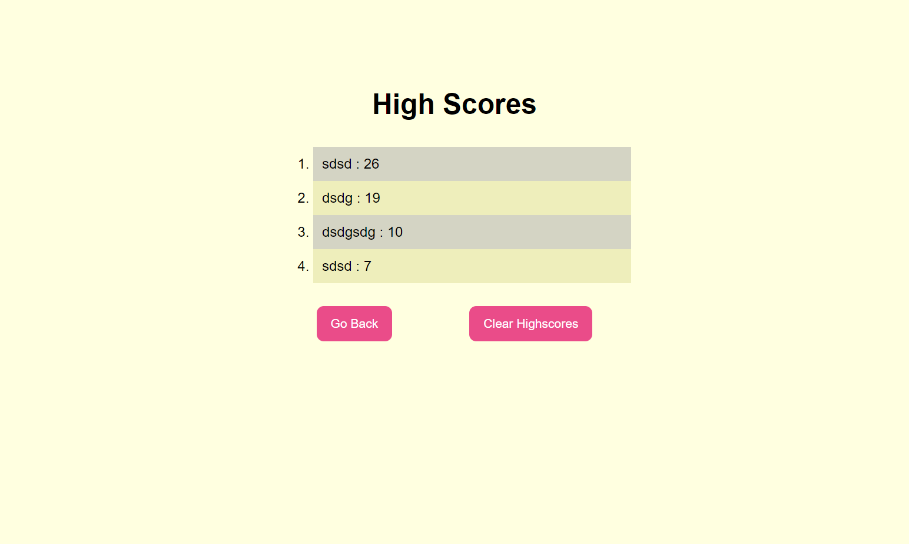

# Code_Quiz

## Description

```
Take a timed quiz and stores high scores
When answer a question incorrectly, subtract the time from the clock
Save the initials and scores.
```

## Deployed Link

https://peterlim995.github.io/Code_Quiz/highscore.html


## Screen Shot




